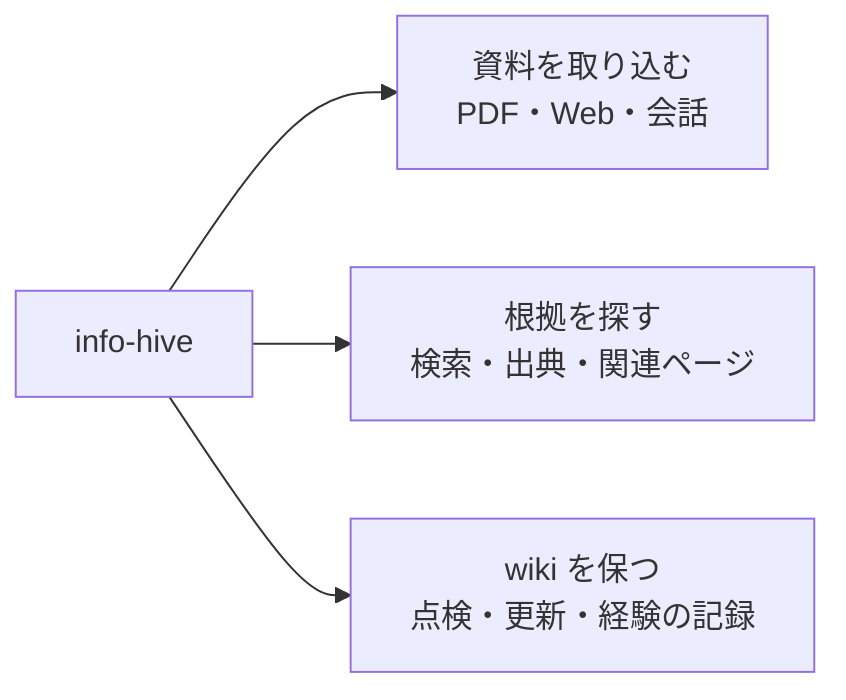

# info-hive のドキュメント

手元の [docs/html/index.html](html/index.html#overview) をブラウザーで開くと、図解と目次を読めます。

## できること

```mermaid
flowchart LR
    wiki["info-hive"] --> ingest["資料を取り込む<br/>PDF・Web・会話"]
    wiki --> query["根拠を探す<br/>検索・出典・関連ページ"]
    wiki --> maintain["wiki を保つ<br/>点検・更新・経験の記録"]
```
